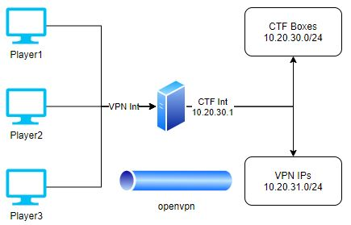

# smoky-netkoth
My version of Irongeek's netkoth CTF scoreboard. Automatically grabs flag ips based on DHCP leases. Scripts build the server including VPN and linux `.ovpn` files.

Credit for scoring server goes to Irongeek and the original can be found at the original site: http://www.irongeek.com/



## Usage:
1.  Set up Ubuntu 20 server with two interfaces (one host only network which will connect CTF targets, and one player network which VPN will connect through, also will need internet from this interface initially).

1.  Build the server with the `buildServer.sh` script by setting up DHCP (note only tested on Ubuntu 20.04).

    ```
    ubuntu@ubuntu2004:~$ chmod 755 buildServer.sh
    ubuntu@ubuntu2004:~$ ./buildServer.sh
    ubuntu@ubuntu2004:~$ ./buildVpn.sh #If you didn't build it at the end of previous step
    ubuntu@ubuntu2004:~$ python netkoth.py
    ubuntu@ubuntu2004:~$ cd ../www #Wherever the smoky-netkoth/www directory is
    ubuntu@ubuntu2004:~$ python -m SimpleHTTPServer 8000
    ```
    
1.  Provide the `~/client-configs/files/client1.ovpn` to players. They need to install `openvpn` and run `sudo openvpn client1.ovpn`

1.  Now have players navigate to `http://10.20.30.1:8000` or your physical IP to see the scoreboard and game instructions

1. Connect any challenge box such as found at vulnhub to the CTF network, that has DHCP enabled and can have a webserver set up (doesn't even need to be set up intially, but once participants root the box they should be able to set one up). 

1. This server will hand out DHCP IPs in the range `10.20.30.101-200`, and periodically check for a flag at `http://IP:80/flag.html`. Players will receive points by filling their team name into this `flag.html` file in the format `<team>USERNAME</team>`

1.  Have fun!!

## SmokySnake Change log:
| Date | Change|
| :--- | :---- |
| Nov 2020 | Auto box add by retrieving DHCP leases for flags |
| Nov 2020 | Wrote buildServer.sh to build DHCP server|
| Nov 2020 | Highlight current server owner, not top scorer |
| Nov 2020 | Personal server flag option |
| Nov 2020 | Random `flag_port` option | 
| Nov 2020 | `baseconfig.ini` file for user modifiable settings (ignoreservers option) |
| Dec 2020 | `buildVpn.sh` file for automatically deploying a VPN, and creating a single use linux client1.ovpn file |
| Jan 2021 | `buildVpn.sh` takes int and ip params from `buildServer.sh` which now handles multiple interfaces |

## Features to add:
- [x]  VPN
- [ ]  Display host name not flag on scoreboard
- [ ]  Separate score page from instructions page
- [ ]  Set up other point scoring types (not just http, e.g. have servers phone home or server check services are up
- [ ]  Introduce firewalls and pivot machines to unflatten network
- [ ]  Create windows client1.ovpn file too in the `buildVpn.sh` file
